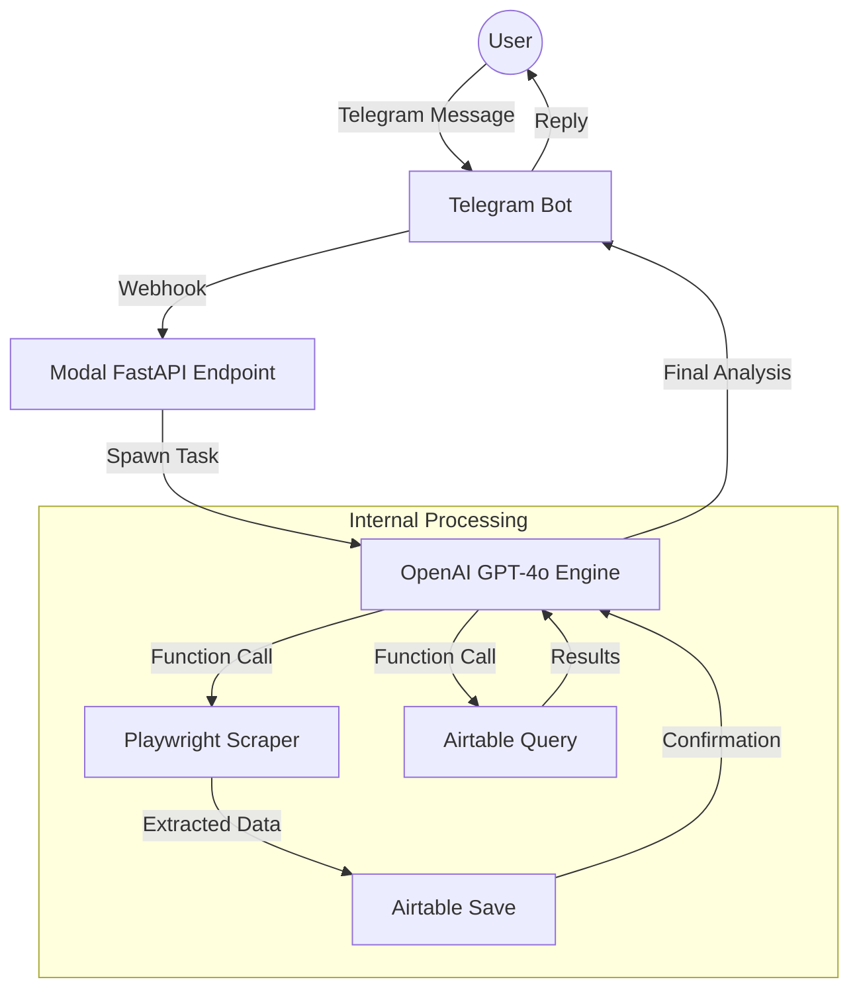

# AI-Powered Telegram Lead Generator

> An AI-powered, serverless Telegram agent that scrapes Google Maps for business leads and manages them in Airtable — all through natural language conversation.


---

## Overview

**AI-Powered Telegram Lead Generator** transforms simple chat messages into structured business intelligence. Instead of complex dashboards or rigid commands, you simply *talk* to your lead generator:

> *"Find me 10 coffee shops in Thakur Village and save them"*
> *"Show me plumbers in Kandivali rated above 4 stars"*

The bot uses **OpenAI's function-calling API (GPT-4o)** to understand intent, spins up a **headless Playwright browser** (locally or via Modal) to scrape Google Maps, and saves the results directly to **Airtable** as a structured CRM database.

Built to be **100% Serverless** on Modal, or run locally for rapid development.

---

## Features

- **Natural Language Interface** — No slash commands to memorize; just chat naturally.
- **Intelligent Maps Scraping** — Headless Playwright browser extracts names, addresses, websites, and ratings.
- **AI Intent Routing** — OpenAI GPT-4o automatically decides whether to scrape new data or query your existing database.
- **Airtable CRM Integration** — All leads are bulk-uploaded and instantly queryable with filters (city, rating, status).
- **Cloud Native Execution** — Hosted on Modal with zero idle cost and high performance background tasking.
- **Async Background Tasks** — Webhooks respond instantly to the user while scraping runs in a dedicated cloud container.
- **Consent & Redirect Bypass** — Automatically handles EU cookie dialogs and direct "single-place" redirects.

---

##  Architecture



---

## 📁 Project Structure

```text
ai-telegram-lead-generator/
├── src/
│   ├── modal_bot.py           # Serverless entry point (Modal app + FastAPI webhook)
│   ├── telegram_bot.py        # Local polling bot (high-speed development mode)
│   ├── scrape_google_maps.py  # Playwright-based scraping engine
│   ├── airtable_save_leads.py # Airtable CRM write operations
│   ├── airtable_pull_leads.py # Airtable CRM read/query operations
│   └── set_webhook.py         # Utility: Connect Telegram to your Modal URL
├── .env                       # Local secrets (ignored by Git)
├── .env.example               # Template for your credentials
├── requirements.txt           # Main dependencies
└── README.md                  # Project documentation
```

---

##  Quick Start

### 1. Requirements
- Python 3.11+
- [Telegram Bot Token](https://t.me/BotFather)
- [OpenAI API Key](https://platform.openai.com/api-keys)
- [Airtable Token & Base ID](https://airtable.com/create/tokens)

### 2. Installation
```bash
# Clone the repository
git clone https://github.com/your-username/ai-telegram-lead-generator.git
cd ai-telegram-lead-generator

# Setup virtual environment
python -m venv .venv
source .venv/bin/activate  # Windows: .venv\Scripts\activate

# Install dependencies
pip install -r requirements.txt
playwright install chromium
```

### 3. Environment Setup
Copy `.env.example` to `.env` and fill in your keys.

### 4. Running Locally
For rapid iteration without cloud deployment:
```bash
python src/telegram_bot.py
```

### 5. Deploy to Production (Modal)
```bash
# Store secrets in Modal cloud
modal secret create telegram-bot-secrets .env

# Deploy the serverless app
modal deploy src/modal_bot.py

# Link the generated URL to Telegram
python src/set_webhook.py <YOUR_MODAL_WEBHOOK_URL>
```

---

## 💬 Usage Examples

| User Message | Bot Action |
|---|---|
| *"Find 5 plumbers in Mumbai"* | Scrapes Google Maps → Saves to Airtable |
| *"Get 10 coffee shops in Toronto"* | Scrapes Google Maps → Saves to Airtable |
| *"Show me leads in Kandivali"* | Queries Airtable for existing records |
| *"Any plumbers rated above 4 stars?"* | Queries Airtable with a rating filter |

---

## ⚙️ Technical Highlights

- **LLM Tool Calling**: OpenAI's native `tools=` API eliminates the need for regex parsing — the model handles argument formatting from natural language automatically.
- **Async Webhook Architecture**: Solves Telegram's 15-second response limit on Modal by separating the fast webhook endpoint from the long-running scraping task.
- **Headless Resilience**: Handles EU cookie/consent dialogs, infinite scroll, and direct single-place page redirects from Google Maps via Playwright.

---

## 📄 License

This project is licensed under the MIT License.
